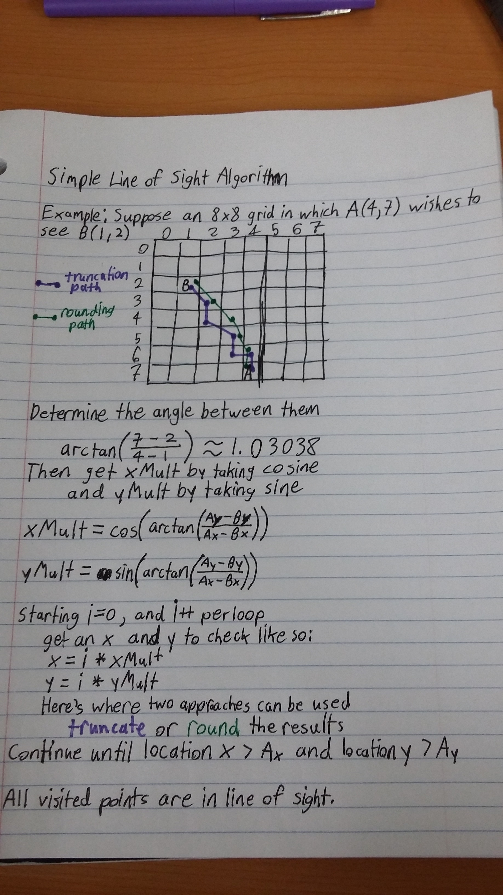

# cs_group_project
Group project for Contemporary Programming Languages: C#

### Using files to store level data
 - XML seemed like a good choice, since we can tag individual elements and therefore set things like level descriptions and names separate from the levels grid
 - XML File Tutorial: https://www.youtube.com/watch?v=M4aXKPN0nK0

### Line of sight algorithm
 - We needed a line of sight algorithm for the Search Analyzer's game mode
 - (in which spaces can be obscured by other objects)
 - I did some trial and error and came up with two possible solutions, found below
 - 